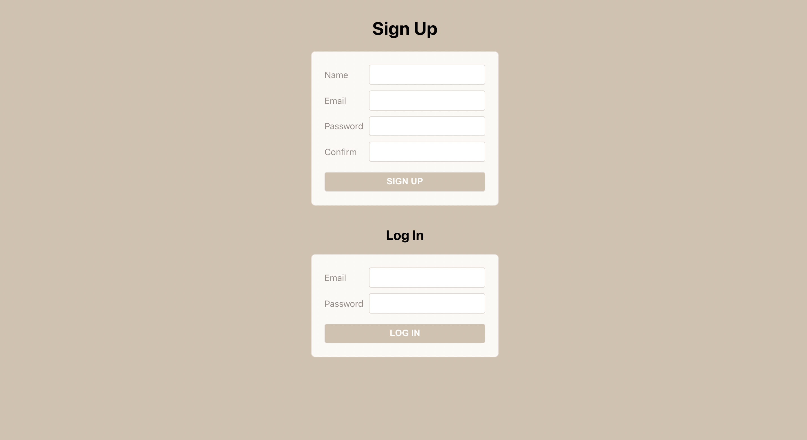
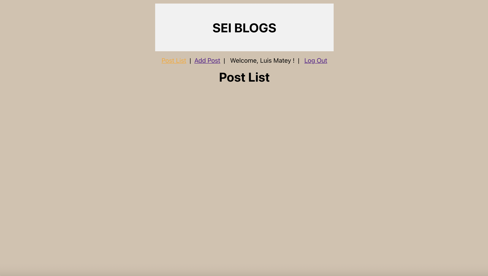

# SEI BLOGS
### This a blog where students from the SEI cohort can write posts sharing their experience studying in GA to help other people wanting to join the course.
[Open app in Heroku](https://sei-blog-project.herokuapp.com/list)

### Technologies used
* React 
* Node JS
* MongoDB 
* Mongoose
* Javascript
* Express
* CSS

### Next features
* Improve UI.
* Post images in the blog.
* Use an API.

[Trello planning](https://trello.com/b/vuSQYerC/sei-blog)

